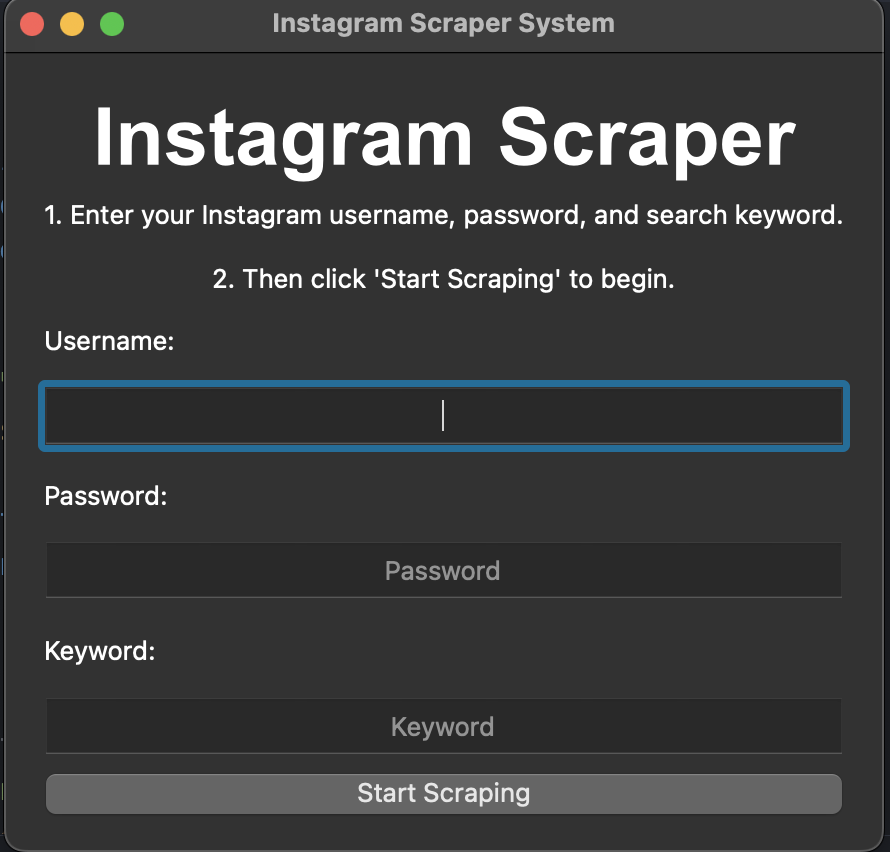

# Instagram-image-scrape
Selenium+pyqt5

## IG scraper user interface

### How to use and run
In the end of Services/Scraper.py, you can change the username/password/keyword to your own.  
After revise that, you can run this py file to scrape.
## Features
[Demo video](https://youtu.be/u9mV5-VXe-M)