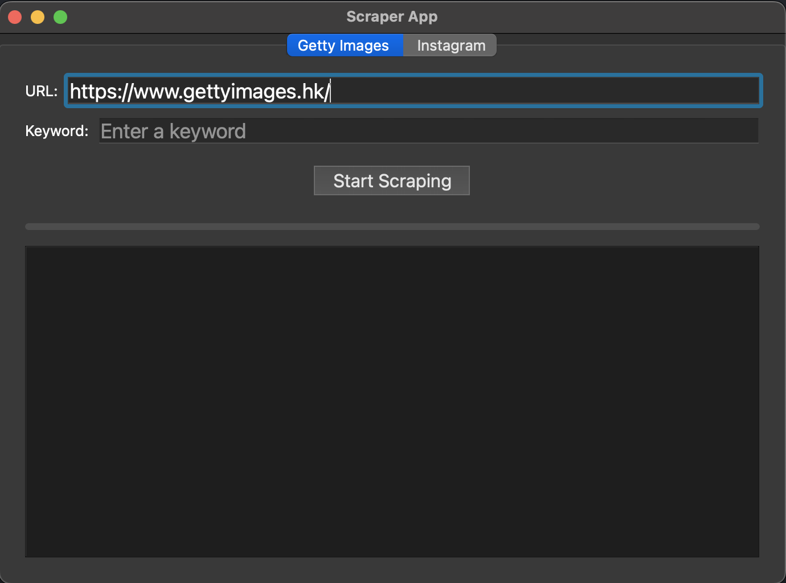
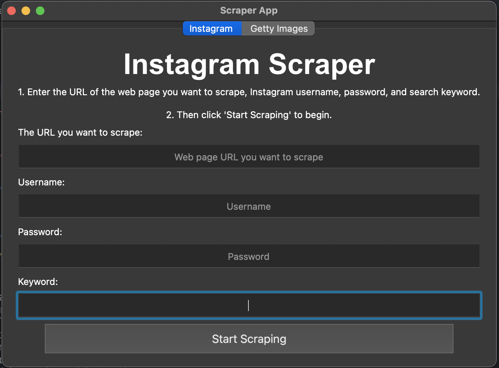

# Instagram-image-scrape

## IG scraper user interface

### Scrape gettyimages tab
1. The default URL value is gettyimages page.
2. Just type the keyword and the click start scraping.
3. Images will download in root/Collections/xxx  
    <b> XXX means the keyword you type 

### Scrape IG tab
1. Type IG URL and then input your username password keyword on it
   

### Scrape Getty-images tab
<b>Features on the way.</b>

### How to use and run
<b>Way1:</b>

You can run main.py directly.
Just run it and type the following requirements: URL, username, password, keyword.

<b>Way2:</b>

In the end of Services/Scraper.py, you can change the username/password/keyword to your own.
After revise that, you can run this py file to scrape.

# Features
## gettyimages scrape
[gettyimages-scrape-BOT](https://youtu.be/SwVbu-BiF6g)

[Multi-thread-for-scraping](https://youtu.be/DrEFG9UBGoA)
## IG picture scrape
[IG Demo video](https://youtu.be/u9mV5-VXe-M)